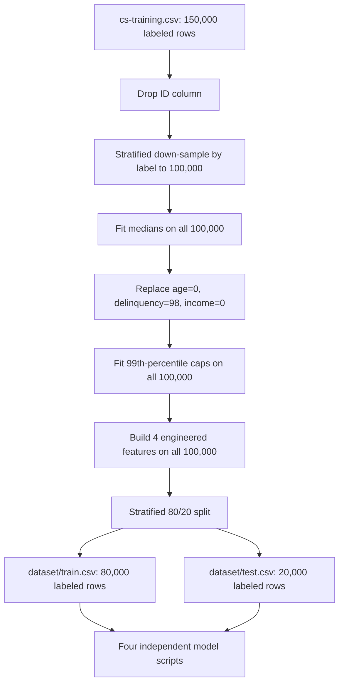

# PROJECT AUDIT

> Stage 0 Repository Audit
> 审查日期：2026-07-21（Asia/Singapore）
> 审查范围：仓库结构、原始/处理后数据、README、5 个 Python 脚本、数据字典、实验报告 DOCX/PDF、旧版 PPT。
> 限制：本轮未重训模型，未把旧报告/PPT 中的数值当作已验证结果。

## 1. Executive Summary

当前项目不能直接作为一套 leakage-safe、reproducible 的最终实验。最主要的原因是：

1. `preprocess_v2.py` 在划分内部训练/测试集之前，已经用全部 100,000 条样本计算缺失值中位数和 99% 分位截断点，构成确定的预处理泄漏（`submission/preprocess_v2.py:68-121, 153-169`）。
2. XGBoost 最终模型把内部测试集传入 `eval_set` 并使用 early stopping，测试集实际参与了最佳迭代轮数的选择（`submission/XGBoost/train.py:131-150`）。
3. LightGBM 在 Optuna 调参之前已计算并打印一次测试集基线结果，调参后再次评估测试集（`submission/LightGBM/train.py:120-132, 211-229`），不满足“测试集只在方案锁定后最终使用一次”。
4. 仓库没有任何模型输出、预测文件、日志、参数 JSON 或可追溯的指标 CSV。README、报告和 PPT 里的 AUC/KS/阈值/耗时/SMOTE 结果因此均不能从仓库证据链独立复核。
5. 报告、PPT、README 与当前代码存在多项直接矛盾，包括 SMOTE、Logistic Regression 训练集分布、Random Forest 树数、LightGBM 不平衡参数/耗时/特征重要性类型以及 XGBoost 测试集隔离说法。

结论：原始数据、四类模型选型、部分训练代码结构可保留；数据划分与预处理、统一评估、最终结果和 presentation artifacts 必须重做。

## 2. Repository Overview

### 2.1 当前 workspace 完整目录树

```text
<audit_workspace>/
├── .DS_Store
├── 第九组  Give Me Some Credit  机器学习实践.zip
├── 第九组  Give Me Some Credit  机器学习实践/
│   ├── submission/
│   │   ├── README.md
│   │   ├── preprocess_v2.py
│   │   ├── dataset/
│   │   │   ├── train.csv
│   │   │   └── test.csv
│   │   ├── LogisticRegression/train.py
│   │   ├── RandomForest/train.py
│   │   ├── XGBoost/train.py
│   │   └── LightGBM/train.py
│   ├── 原始数据集（Give Me Some Credit）/
│   │   ├── archive.zip
│   │   └── archive/
│   │       ├── Data Dictionary.xls
│   │       ├── cs-training.csv
│   │       ├── cs-test.csv
│   │       └── sampleEntry.csv
│   ├── 第九组实验报告.docx
│   ├── 第九组实验报告.pdf
│   └── 第九组答辩ppt.pptx
└── 课程 ppt/
    ├── Class 1.1 Introduction to Project.pdf
    ├── Class 1.2 Machine Learning.pdf
    ├── Class 1.3 Data and Preprocessing.pdf
    ├── Class 2.1 KNN and CF.pdf
    ├── Class 2.2 Support Vector Machine.pdf
    ├── Class 2.3 Ensemble Classifier.pdf
    ├── Class 3.1 Unsupervised Learning.pdf
    ├── Class 3.2 Clustering DBSCAN Graph-Based.pdf
    ├── Class 4.1 Neural Network.pdf
    └── Class 4.2 MLP Keras.pdf
```

### 2.2 文件分类

| 类别 | 文件 | 审查结果 |
|---|---|---|
| 原始数据 | `archive/cs-training.csv`, `cs-test.csv`, `sampleEntry.csv`, `Data Dictionary.xls` | 已读取并核对结构、缺失、标签和文件关系 |
| 处理后数据 | `submission/dataset/train.csv`, `test.csv` | 已读取；已在内存中重建当前预处理流程并确认合并后多重集一致 |
| 代码 | 1 个预处理 + 4 个模型脚本 | 5/5 通过 Python 3.12 `py_compile` 语法检查；未执行训练 |
| 文档 | README、31 页实验报告 DOCX/PDF、28 页 PPT | 已读取文本并渲染抽查页面/幻灯片 |
| 课程资料 | `课程 ppt/` 下 10 份 PDF | 已纳入目录清单；不是项目实验产物，未用于证明现有实验数值 |
| 压缩包 | 项目快照 ZIP、原始数据 ZIP | 已列出内容；原始数据 ZIP 含 4 个官方文件 |
| 已有运行输出 | 无 | 未找到 `outputs/`、`results*/`、模型文件、指标 CSV/JSON、预测文件或日志 |

## 3. Data Inventory

### 3.1 文件级盘点

| 文件 | 角色 | Shape | 标签 | 缺失 | 重复 |
|---|---|---:|---|---|---|
| `archive/cs-training.csv` | Kaggle 原始有标签训练集 | 150,000 × 12 | 0: 139,974; 1: 10,026; 正类率 6.684% | `MonthlyIncome` 29,731 (19.8207%); `NumberOfDependents` 3,924 (2.6160%) | 含 ID 时 0；去 ID 后 609 |
| `archive/cs-test.csv` | Kaggle 官方无标签测试集 | 101,503 × 12 | `SeriousDlqin2yrs` 全为 NaN | `MonthlyIncome` 20,103; `NumberOfDependents` 2,626 | 含 ID 时 0；去 ID 后 328 |
| `archive/sampleEntry.csv` | Kaggle 提交模板 | 101,503 × 2 | 无真实标签 | 0 | 0 |
| `submission/dataset/train.csv` | 从 `cs-training.csv` 分出的内部 development train | 80,000 × 15 | 0: 74,653; 1: 5,347; 正类率 6.68375% | 0 | 全列重复 342 |
| `submission/dataset/test.csv` | 从 `cs-training.csv` 分出的内部 labeled holdout | 20,000 × 15 | 0: 18,663; 1: 1,337; 正类率 6.685% | 0 | 全列重复 38 |

`sampleEntry.csv` 的 ID 与 `cs-test.csv` 的第一列逐行一致，证明两者是官方测试/提交文件对。`submission/dataset/test.csv` 含真实标签，与 Kaggle 官方测试集无关，建议后续更名为 `internal_test.csv` 或从流程中动态生成。

### 3.2 字段与类型

原始有标签数据包含 1 个行 ID（`Unnamed: 0`, `int64`）、1 个二分类标签（`SeriousDlqin2yrs`, `int64`）和 10 个输入特征。按当前 CSV 推断：

- `float64`：`RevolvingUtilizationOfUnsecuredLines`, `DebtRatio`, `MonthlyIncome`, `NumberOfDependents`。
- `int64`：`age` 及 6 个账户/逾期次数特征。
- 处理后新增 4 列：`DelinquencyScore` (`int64`), `IncomePerDependent` (`float64`), `LogMonthlyIncome` (`float64`), `HighDebtFlag` (`int64`)。

`Data Dictionary.xls` 只定义了业务含义和类型，没有对逾期次数中的 96/98 给出特殊编码说明。

### 3.3 异常值与重复样本

- 原始训练集三个逾期字段各有 5 个值 96、264 个值 98；269 个受影响行在三个字段上同时取相同异常值。
- 96 组共 5 行，其中 4 行为正类（80%）；98 组共 264 行，其中 143 行为正类（54.17%）。这与整体 6.684% 相差极大，直接改成 0 可能丢失强信号。
- 100,000 条抽样中，三个逾期字段各含 2 个 96 和 178 个 98。当前脚本只把 98 置 0（`submission/preprocess_v2.py:95-102`），96 被保留。处理后 `train.csv` 中三个字段仍各有 2 个 96。
- 本次检索未找到 Kaggle 数据字典或竞赛原始说明对 96/98 语义的权威定义；“98 = 无记录”必须标记为未证实假设。
- 去除行 ID 后原始训练集有 609 个重复行。处理后 train/test 之间有 102 种完全相同的 14 特征向量，按多重数计可形成 431 对跨集匹配。因 ID 已丢失，无法确定这些是重复客户还是特征碰撞，需在划分前明确去重/分组策略。

### 3.4 当前预处理参数（实际数据重建）

| 参数 | 当前值 | 实际 fit 范围 |
|---|---:|---|
| `MonthlyIncome` median | 5,380 | 划分前的全部 100k |
| `NumberOfDependents` median | 0 | 划分前的全部 100k |
| `age` median | 52 | 划分前的全部 100k（当次抽样中无 age=0） |
| `RevolvingUtilization...` 99% cap | 1.10079097134 | 划分前的全部 100k |
| `DebtRatio` 99% cap | 5,025.02 | 划分前的全部 100k |
| `MonthlyIncome` 99% cap | 23,000 | 划分前的全部 100k |

报告/PPT 中的收入中位数 5,400 与实际当前数据/脚本重建值 5,380 不一致。

### 3.5 数据完整性指纹

| 文件 | SHA-256 |
|---|---|
| `submission/dataset/train.csv` | `c574750b6b2d3318b4a70547a1e83851ba4e95c469d55214542adf8e494f223b` |
| `submission/dataset/test.csv` | `f2772b7c3920d0c1dcd35f3fd6513268d0e114fa9c982026819d23f829a1497b` |
| `archive/cs-training.csv` | `1bd46da486a5708c58c7b01a034fae2a13b327f6f7b62ea7ba4fe3b5824b24ac` |
| `archive/cs-test.csv` | `bab363a2a807218d32a51f5fc9668b8be7977795065edd386abc8546abaa5b78` |
| `archive/sampleEntry.csv` | `578b4b01d0f6ed7f97f1988afff0c41194e72bf4b25707119903d4de3dc1dcea` |

## 4. Current Data Flow



代码证据：读取绝对路径在 `submission/preprocess_v2.py:34`；按标签分层下采样在 `:42-65`；全数据中位数/截断在 `:68-121`；特征工程在 `:123-150`；最后才分割在 `:153-179`；绝对路径写出在 `:188-192`。

已在内存中按代码重建 100k 抽样和全部转换；重建结果与现有 `train.csv + test.csv` 按全列哈希的多重集完全相同。因此，当前处理数据可确认来自该流程。

## 5. Current Model Pipelines

| 模型 | 真实训练/选择流程 | 不平衡处理 | 阈值 | 测试集使用 | 主要问题 |
|---|---|---|---|---|---|
| Logistic Regression | 80k 内部分 64k/16k；默认从 64k 再抽 50k 做 28 组×5 折 GridSearchCV；最优组合在 64k 重训，用 16k 选 F1 阈值；最后在全 80k 重训 | 搜索 `None` / `balanced` | 同时计算 0.5 和 validation-F1 阈值 | 最终模型一次计算内部 test；但绘图/分类报告默认使用优化阈值 | 上游处理泄漏；`DelinquencyScore` 与 3 个原始组成项共存；旧报告结果无输出证据 |
| Random Forest | 在全 80k 上对 4 组参数做 5 折 OOF；按 OOF ROC-AUC 选参数；在最优 OOF 概率上选 F1 阈值；全 80k 重训 | `balanced_subsample` | OOF-F1 阈值，代码不输出 0.5 对照 | 预测后才读标签评估，未见测试集调参 | 上游泄漏；输出路径绝对化；报告树数/阈值与代码不一致 |
| XGBoost | 64k/16k 验证集搜索 `max_depth=[3,4,5,6]` 并 early stop；全 80k 做 5 折稳定性检查；全 80k 训练最终模型 | `scale_pos_weight` | `predict()` 默认 0.5 | **内部 test 被用于最终 early stopping** | 测试污染；读写路径与 CWD/个人 D 盘绑定 |
| LightGBM | 80k 内部分 68k/12k；先训练 baseline 并评估 test；在固定 12k validation 上做 200 次 Optuna；最优模型仍只用 68k 训练并 early stop | `scale_pos_weight` | `predict()` 默认 0.5 | 调参前后重复查看 test | 测试集重用；未用锁定迭代数在 80k 重训；报告将 split importance 错写为 gain |

关键代码位置：

- Logistic Regression：Pipeline 中位数+标准化 `submission/LogisticRegression/train.py:75-91`；数据划分/抽样 `:273-285`；网格搜索 `:287-304`；验证集选阈值 `:306-311`；全 80k 重训/测试 `:313-348`。
- Random Forest：绝对输出路径 `submission/RandomForest/train.py:43-46`；硬编码样本/正类数 `:76-117`；参数网格 `:120-147`；OOF 搜索/阈值 `:180-214, 259-291`。
- XGBoost：验证集搜索 `submission/XGBoost/train.py:43-89`；5 折验证 `:91-124`；测试集 early stopping `:126-150`；绝对输出路径 `:169-200, 235-237`。
- LightGBM：固定路径/搜索次数 `submission/LightGBM/train.py:29-58`；划分 `:99-117`；baseline 提前评估 test `:120-132`；Optuna `:135-188`；最终训练/评估 `:190-229`；默认 split importance `:247-267`。

## 6. Existing Outputs

仓库内没有任何由上述脚本生成的结果目录。因此：

- README `submission/README.md:69-74` 的四模型 AUC/KS 表只是文档声明，不是可重算证据。
- 实验报告 PDF 第 16-23 页和 PPT 第 8、11、18、23-26 页的指标/图表属于“历史声称，当前未验证”。
- 报告第 6 页声称存在 `docs/preprocessing_log.md`，仓库中无此文件。
- 当前不能确认旧图是由当前代码、旧版代码还是手工汇总生成。

## 7. Reproducibility Assessment

| 项目 | 状态 | 证据/说明 |
|---|---|---|
| 固定随机种子 | 部分满足 | 5 个脚本主要流程使用 42；Random Forest 各折模型用 `42+fold`，仍可重现 |
| 语法可解析 | 满足 | 5/5 Python 文件通过 Python 3.12 `py_compile` |
| 当前环境可直接运行 | 不满足 | 当前默认 Python 3.9.6 缺少 pandas/scikit-learn/xgboost/lightgbm/optuna/matplotlib/joblib |
| 依赖锁定 | 不满足 | 无 `requirements.txt`、`environment.yml`、`pyproject.toml` 或 lockfile |
| 可移植路径 | 不满足 | Preprocess/XGBoost/Random Forest 含个人 Windows 绝对路径；XGBoost/LightGBM 输入路径依赖 CWD |
| 一键入口 | 不满足 | 无 Makefile/统一 runner；4 个模型使用不同配置和输出结构 |
| 配置与实验元数据 | 不满足 | 参数分散硬编码；无数据哈希、Git 状态、统一耗时/环境记录 |
| 自动测试 | 不满足 | 无 `tests/`；Random Forest 的 assert 是运行时自查，不能覆盖上游 preprocessing leakage |
| 原始数据保护 | 部分满足 | 当前脚本读原始 CSV、写另一路径，但无自动哈希保护测试 |

README 写 Python >=3.8（`submission/README.md:26-36`），但 Random Forest 使用 `list[str]` 和字典合并 `|`（`submission/RandomForest/train.py:76, 240`），实际至少要求 Python 3.9。建议统一为 Python 3.10+。

## 8. Leakage and Evaluation Risks

### P0 — 必须在任何新结果之前修复

1. **划分前预处理泄漏**：中位数、异常替换参考值和分位截断点都使用了后续内部 test 的分布信息（`submission/preprocess_v2.py:68-121`）。
2. **XGBoost 测试集 early stopping**：最终 `best_iteration` 是看了内部 test 后选出（`submission/XGBoost/train.py:131-150`），与报告第 10 页“测试集仅最终使用一次”直接矛盾。
3. **LightGBM 测试集重复暴露**：调参前输出 baseline test 指标，调参后再输出 final test 指标（`submission/LightGBM/train.py:120-132, 211-229`）。即使代码没有自动用 baseline test 选参，人工开发过程也已经看到 test 反馈。
4. **无可验证结果证据链**：当前 presentation 所需的主结论无法由仓库内输出复核。在重跑 leakage-safe 实验前，不应再引用旧 AUC/KS/耗时作为最终结论。

### P1 — 影响公平对比、可解释性或可复现性

1. **内部 test 命名歧义**：`submission/dataset/test.csv` 是有标签 holdout，不是 Kaggle official test。
2. **跨集重复特征向量**：102 种完全相同特征向量同时出现在 train/test；需用保留的原始 ID 进一步确认客户级重复和划分策略。
3. **96/98 处理无证据**：数据字典无特殊编码说明；98 直接置 0、96 保留的不对称处理缺乏根据和消融。
4. **阈值口径不统一**：XGBoost/LightGBM 使用 0.5；Random Forest 只报 OOF-F1 阈值；Logistic Regression 代码输出两种，但绘图/分类报告使用优化阈值。旧报告却声称混淆矩阵统一按 0.5 计算（PDF 第 15 页）。
5. **SMOTE 声明无代码/输出支持**：当前 5 个脚本都没有 SMOTE/imblearn。README 声称“三个树模型”都完成对比（`submission/README.md:81`），报告第 7 页又写 LightGBM 未进行 SMOTE，两者互相矛盾。
6. **Logistic Regression 共线性与解释风险**：`DelinquencyScore` 是三个原始逾期字段的精确线性组合（`submission/preprocess_v2.py:130-135`），但当前 LR 全部同时使用。报告第 19 页出现综合分正系数、三个原始项大负系数，是典型不稳定表征，不得解释为业务因果。
7. **Random Forest 参数不一致**：当前代码正式网格为 `n_estimators=300`（`submission/RandomForest/train.py:128-136`），报告第 12-14 页写 150；报告还把其混淆矩阵标为阈值 0.5，代码实际使用 OOF-F1 阈值。
8. **LightGBM 说法与实现不一致**：README/报告写 `is_unbalance`，代码是 `scale_pos_weight`（`submission/LightGBM/train.py:113-127`）；代码未设 `importance_type="gain"`，`feature_importances_` 默认是 split count，与 `:247-257` 注释和报告的 Gain 说法不符；`subsample` 未配套 `subsample_freq/bagging_freq` 时可能不生效，不能直接宣称“60% 行采样”。
9. **LightGBM 固定验证集过度搜索/未重训全量**：200 次试验始终复用同一 12k validation，存在验证集过拟合风险；最终模型仍只用 68k 拟合（`submission/LightGBM/train.py:190-205`）。
10. **绝对路径/CWD 依赖**：Preprocess、XGBoost、Random Forest 不可移植；LightGBM/XGBoost 需在 `submission/` 目录启动才能找到数据。
11. **依赖、配置、输出规范缺失**：无 requirements、无统一 runner、无模型统一指标表、无日志、无自动检查。

### P2 — 工程质量与表述改进

1. Preprocess/XGBoost/LightGBM 为模块顶层直接执行，不利于单测和复用。
2. Preprocess/XGBoost/LightGBM 全局屏蔽 warning，可能隐藏 pandas chained assignment、模型参数无效等信号。
3. 四个模型各自重复实现 AUC/KS/混淆矩阵与绘图，字段名、大小写、PR-AUC 和 threshold strategy 不一致。
4. Random Forest 对样本数和正类数做精确硬编码（`submission/RandomForest/train.py:76-117`），数据流程一改就会失效。
5. LightGBM 声明 MedianPruner，但 objective 没有 `trial.report()` / `trial.should_prune()`，当前剪枝器不构成可验证的试验剪枝。
6. 旧报告/PPT 有多处过度业务化表述，例如“业界优秀”、“可部署完整链路”、“直接映射”；又未系统讨论 fairness、概率校准、human review 和 drift monitoring。
7. 报告的“年龄越大越稳定”以及特征重要性业务含义属相关性解读，不应写成因果结论。

## 9. Code / README / Report / PPT Consistency Table

| Artifact | Claim | Actual Code / Data | Status | Recommended Fix |
|---|---|---|---|---|
| README `:5, 14-15` | 统一 80k train / 20k test | 数据 shape 属实，但 test 是内部有标签 holdout | 部分一致 | 改称 internal train/holdout，与 Kaggle official test 区分 |
| README `:71` / 报告第 22 页 / PPT 8 | XGBoost AUC 0.8673, KS 0.5827 | 代码可计算该指标，但仓库无输出；最终 early stopping 泄漏 test | **未验证/方法无效** | 修复后重跑，不继承旧数值 |
| README `:72` | LightGBM 用 `is_unbalance + Optuna` | 代码用 `scale_pos_weight + Optuna` | **不一致** | 以统一配置和实际运行元数据为准 |
| README `:81` | 三个树模型均完成 SMOTE 负优化验证 | 无 SMOTE 代码/输出；报告第 7 页明说 LightGBM 未做 | **不一致/未验证** | 删除无证据声明或在训练折内重做小型对照 |
| 报告第 3 页 | train 为 74,660/5,340 | 实际为 74,653/5,347 | **不一致** | 数字由 audit/运行产物自动生成 |
| 报告第 5 页 / PPT 5 | `MonthlyIncome` 中位数 5,400 | 当前脚本与数据重建为 5,380 | **不一致** | 修复 leakage 后报告 train-only median |
| 报告第 5 页 / PPT 5 | 98 是“无记录编码”，534 条 | 字典无该定义；实际是 178 行×3 个单元格；96 仍保留 | **未证实/表述误导** | 改称 534 个字段值/178 行，做异常策略消融 |
| 报告第 6 页 | 全模型最重要特征、35.4% | 无可追溯输出；LightGBM 旧结果又将其排第 7 | **不一致/未验证** | 按模型分开报告，注明 importance 类型 |
| 报告第 6 页 | 存在 `docs/preprocessing_log.md` | 文件不存在 | **不一致** | 后续由 pipeline 生成真实日志 |
| 报告第 7 页 / PPT 16 | LR 训练集已 SMOTE 为 40k/40k | 当前 train 为 74,653/5,347；LR 代码无 SMOTE | **不一致** | 不得使用该旧结果；重跑 class-weight 基线/对照 |
| 报告第 10-11 页 | XGBoost test 全程不参与调参，同时用 test early stop 到 478 | 代码确实用 test `eval_set` | **文档自相矛盾/P0** | 在 validation 上锁定迭代数，再重训；test 只评估 |
| 报告第 12-14 页 | RF `n_estimators=150` | 当前正式代码只搜索 300 | **不一致** | 参数只从最终 JSON 引用 |
| 报告第 15、17 页 | 阈值依赖指标/混淆矩阵都是 0.5 | RF 代码使用 OOF-F1 阈值；LR 绘图使用 validation-F1 阈值 | **不一致** | 统一同时输出 0.5 和 validation rule |
| 报告第 15/23 页、PPT 24/26 | LightGBM 耗时分别约 6.9 min / 1.6 s | 无运行日志；代码的 `train_time` 从 Optuna 开始计到总结，不是纯 final fit | **不一致/未验证** | 分开 tuning time、final fit time、inference time |
| 报告第 19 页 | LR 系数可直接解读 | 精确线性共线导致系数方向翻转 | **高风险解读** | 做 3 组逾期特征消融，只说相关性 |
| 报告第 22 页 | LR CV AUC 0.8852 高于 test AUC 0.8436 | 当前代码无输出可复核，且报告声称来自不同 SMOTE 数据 | **未验证/口径疑似不同** | 统一数据、折内 preprocessing 后重跑 |
| PPT 14 vs 17-18 | LR 先说 0.5 分类，又提 0.7386 和 0.5，最终展示 0.5 | 当前代码会自动选 validation-F1 阈值并用其画图 | **不一致** | 明确阈值选择规则，两种口径并列 |
| PPT 22-24 | LightGBM 最优参数/指标/前五特征 | 代码存在相应搜索空间，但无 study 输出可复核；importance 类型误标 | **未验证** | 保存 Optuna DB/CSV、best params JSON 和明确 importance type |
| PPT 26 | LightGBM 训练效率 1.6s | PPT 24 又写 6.9 min，报告第 22/23 页同样冲突 | **不一致** | 由统一 timing 代码自动生成 |

## 10. What Can Be Retained

1. Kaggle 原始 CSV、数据字典和当前处理数据可作为可追溯的 legacy snapshot；原始数据应保持只读。
2. Stage 0 确认线性模型、Bagging 和 Boosting 的比较框架与课程主题匹配。Stage 1 已进一步锁定 Logistic Regression、Random Forest、Balanced Random Forest 和 XGBoost 为核心模型；LightGBM 仅作为 legacy/optional appendix 保留。
3. 固定随机种子、分层划分、以 ROC-AUC 做主排序指标、报告 KS 和少数类指标的方向可保留。
4. Logistic Regression 的 sklearn Pipeline/GridSearchCV 结构、Random Forest 的 OOF 概率阈值选择结构、XGBoost 的 validation early stopping 思路可作为重构参考；不直接在 legacy 脚本上继续开发。
5. 4 个 engineered features 的公式可作为候选特征，但必须在 split 后构建，并用消融验证其价值。
6. 旧 DOCX/PDF/PPT 可作为 legacy 内容清单和视觉参考，但不能作为最终结果数据源。

## 11. What Must Be Redone

1. 从原始有标签数据重新进行分层 train/validation/test 划分，保留行 ID，再只在 train 上 fit 所有中位数、cap 和 scaler。
2. 异常值 96/98 的处理对照，至少比较保留原值与“异常 flag + cap/缺失”方案。
3. Logistic Regression、Random Forest、Balanced Random Forest、XGBoost 的统一评估：相同 split、相同数据预处理边界、相同指标实现，同时报 threshold=0.5 和同一 validation-based rule。
4. XGBoost 的 early stopping/迭代数锁定流程，不得再把 test 传入训练过程。
5. Logistic Regression 的逾期特征共线性消融：原始三项 / 仅综合分 / 三项+综合分。
6. 所有最终指标、图表、参数、耗时和结论；旧数字不自动继承。
7. README、实验报告和 PPT 的数字/表述。本 Stage 0 未修改这三类原文件。

## 12. Items Requiring Human Confirmation

1. **数据规模**：最终实验是使用全部 150,000 条（推荐），还是为时间限制保留固定 100,000 条 development sample？
2. **重复样本**：去 ID 后的 609 个重复行是删除、按 ID 保留，还是按完全特征组分组划分？
3. **96/98 语义**：团队是否持有 Kaggle 讨论链接、旧 notebook 或其他原始依据？如无，建议将它们作为“未知异常群”而非“无记录”。
4. **阈值业务规则**：选用“最大 validation F1”，还是“Recall ≥ 75% 下 Precision 最大”（更贴合当前研究问题）？
5. **成本假设**：FP 和 FN 的相对业务成本是否有课程给定值？若无，应只做情景分析，不伪造银行真实成本。
6. **Age/fairness**：是否将 age 作为模型输入与“移除 age”做 fairness/sensitivity 对照？
7. **Presentation 分工**：四位成员最终讲解页和可用时长需由团队确认。

## 13. Audit Verdict

- **当前数据流程**：可重建，但存在明确 preprocessing leakage。
- **当前模型代码**：语法可解析，部分结构可复用，但不能以当前流程生成最终报告。
- **当前指标**：全部视为 legacy claims / unverified，其中 XGBoost 结果还受 test early stopping 污染。
- **下一步**：先锁定 Stage 1 Experiment Design，再进行 Stage 2 leakage-safe Data Pipeline Refactor。
