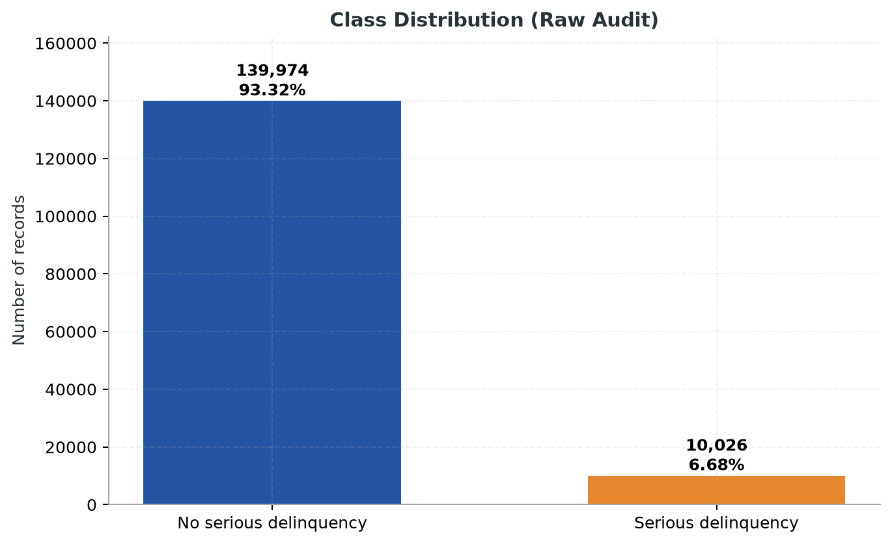
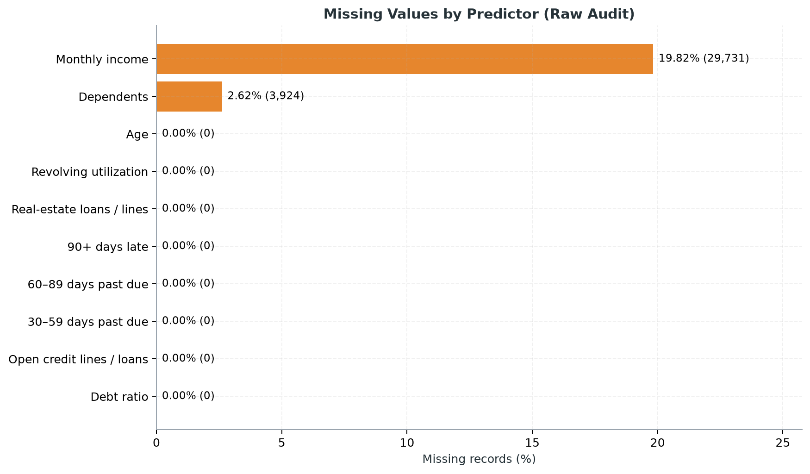
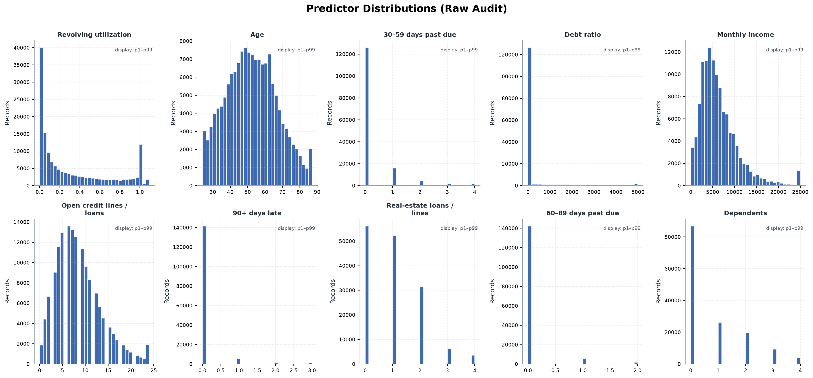
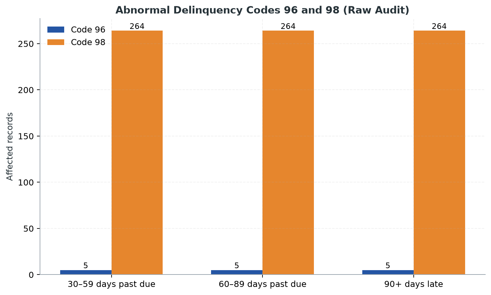
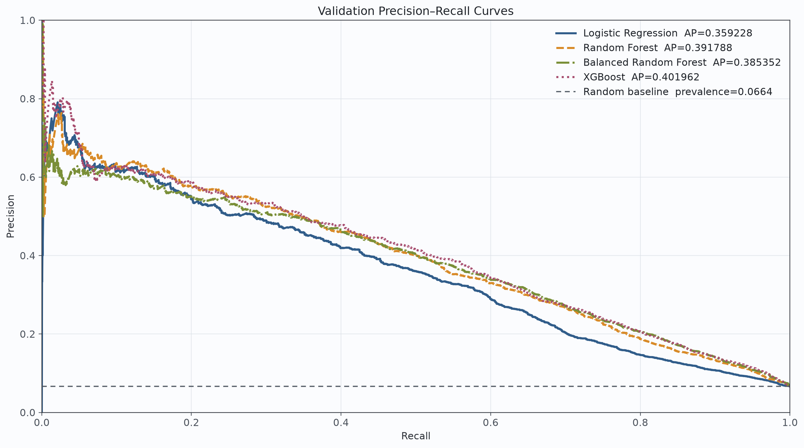
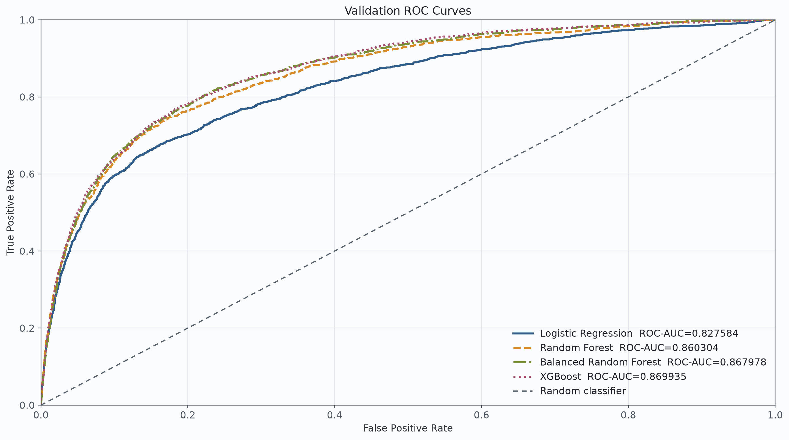
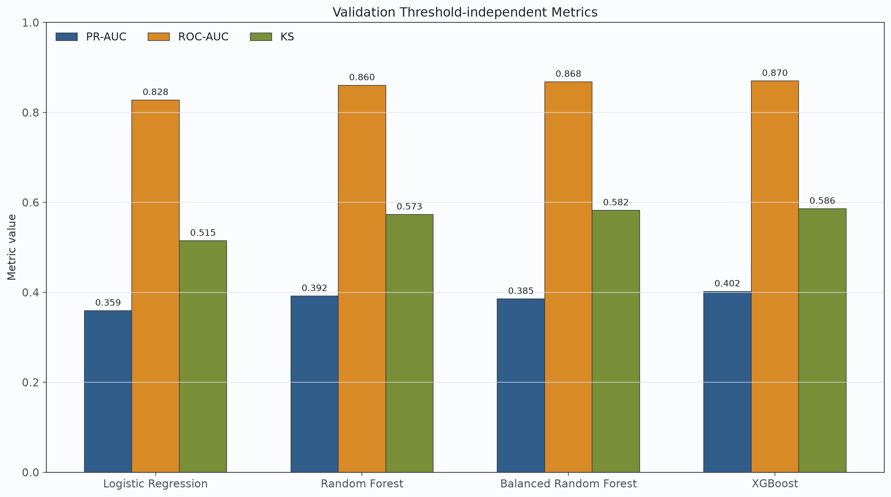
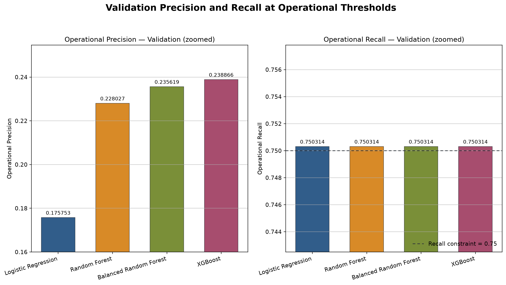
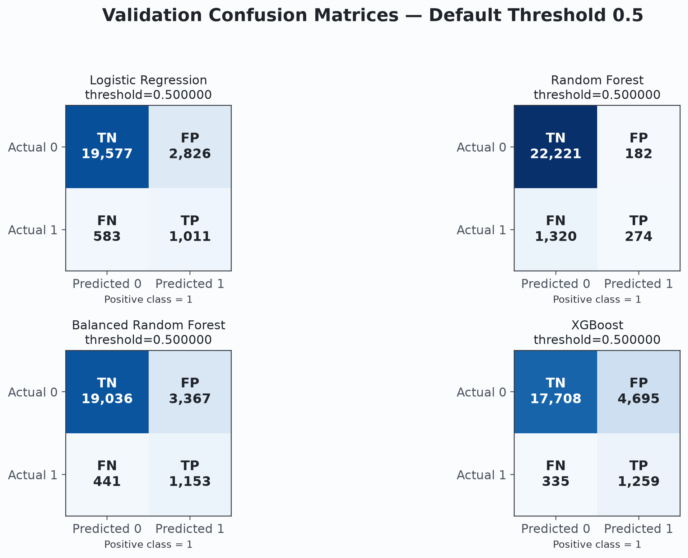
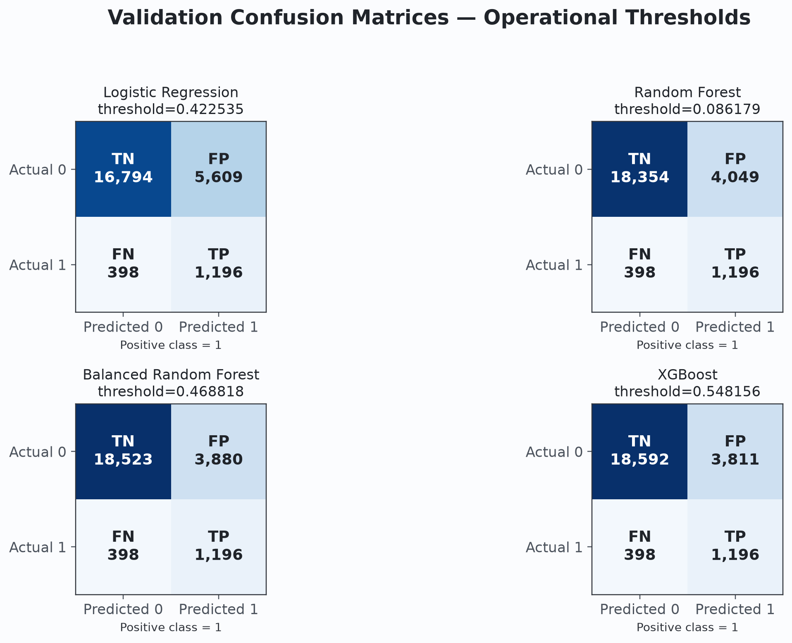

# Cover Information

## Credit Default Risk Prediction under Class Imbalance:
## A Comparative Study of Machine Learning Models

| Item | Information |
|---|---|
| Course | **TODO: Course name** |
| Group | **TODO: Group number** |
| Members | **TODO: Project Lead and Member A–E names** |
| School / Institution | **TODO: School or institution** |
| Instructor | **TODO: Instructor name, if required** |
| Submission date | **TODO: Submission date** |
| Repository | [Wjx871/Singapore_program](https://github.com/Wjx871/Singapore_program) |
| Report branch | `docs/final-report` |
| Baseline SHA | `733fc3fc4e84f018ace1785a64c6f66d0948b00d` |

This report records the project state at the baseline above. All reported model
results are **Validation** results unless explicitly identified otherwise.

# Abstract

Credit-default prediction is a consequential binary-classification problem in
which the minority class is often the class of greatest practical interest.
This project studies default-risk prediction on the Kaggle *Give Me Some
Credit* dataset, using `SeriousDlqin2yrs = 1` as the positive class. The
experiment addresses a positive rate of only 6.723% in the frozen Training
partition, missing income and dependent-count fields, abnormal delinquency
codes, duplicate predictor vectors, leakage risk, and the dependence of
operational behavior on the decision threshold. Four model families were
compared under one frozen, group-aware 64%/16%/20% data contract: Logistic
Regression, Random Forest, Balanced Random Forest, and XGBoost. All models used
Feature Set B, Training-only preprocessing, the same shared experiment runner,
and the same metric and threshold implementations. Average Precision computed
by `sklearn.metrics.average_precision_score` was treated as PR-AUC and used as
the primary metric, with ROC-AUC, the Kolmogorov–Smirnov statistic, threshold
metrics, runtime, and interpretability as supporting evidence.

On the frozen Validation partition, XGBoost candidate `xgb_child5` achieved the
highest PR-AUC (0.401962230), ROC-AUC (0.869935023), and KS (0.585850356).
Under the pre-declared rule that maximizes Precision subject to Recall at least
0.75, it also achieved the highest operational Precision (0.238866) at Recall
0.750314 and threshold 0.548155665398. It is therefore the
Validation-selected model recommended for the one-time sealed evaluation.
This conclusion does not describe Independent Test performance. No Independent
Test metric has been computed for this report version, and the sealed executor
has not yet been implemented and frozen. The principal contribution is not
only a model comparison, but a reproducible and auditable workflow comprising a
frozen group-aware split, leakage-safe preprocessing, shared adapters and
evaluation, deterministic forest inference, provenance correction, and a
strict sealed-evaluation handoff.

# 中文摘要

信贷违约预测属于典型的类别不平衡二分类任务，少数类样本虽然占比较低，却是风险识别的重点。本项目基于 Kaggle *Give Me Some Credit* 数据集，以
`SeriousDlqin2yrs = 1` 为正类，围绕类别不平衡、收入与家庭负担人数缺失、逾期字段中的
96/98 异常编码、重复特征向量、数据泄漏和决策阈值选择等问题，构建了可复现、可审计的机器学习实验流程。数据按固定的 group-aware
方式划分为 64% Training、16% Validation 和 20% Independent Test；所有模型统一使用 Feature Set B、仅在
Training 上拟合的预处理器、共享实验运行器和统一评价函数。项目比较了 Logistic Regression、Random Forest、Balanced Random
Forest 和 XGBoost 四类模型，并以 `average_precision_score` 计算的 PR-AUC 为主指标，辅以 ROC-AUC、KS、阈值指标、运行时间和可解释性分析。

在冻结的 Validation 分区上，XGBoost 候选 `xgb_child5` 的 PR-AUC、ROC-AUC 和 KS 分别为
0.401962230、0.869935023 和 0.585850356，均为四个模型中最高。在“Recall 不低于
0.75 时最大化 Precision”的预声明规则下，其 Operational Threshold 为
0.548155665398，Precision 为 0.238866，Recall 为 0.750314。因此，本项目推荐
`xgb_child5` 作为一次性 sealed evaluation 的 Validation 选定模型。该结论仅适用于当前
Validation 证据，不代表 Independent Test 表现。本报告版本尚未计算任何 Independent Test 指标，sealed
executor 也尚未实现并冻结。项目的主要价值还包括冻结的分组划分、防泄漏预处理、统一模型接口与评价框架、森林模型确定性推理、结果来源治理以及严格的测试集交接机制。

# Keywords

credit default prediction; class imbalance; logistic regression; random forest;
balanced random forest; XGBoost; PR-AUC; operational threshold

# 1. Introduction

## 1.1 Background

Credit-risk assessment estimates whether a borrower may experience a specified
adverse outcome within a future period. In the *Give Me Some Credit* task, the
target indicates serious financial distress within two years [1]. A useful
predictive system can support risk triage and resource allocation, but the
technical problem is more demanding than maximizing the fraction of correctly
classified records. The cost of overlooking a high-risk case is different from
the cost of reviewing a false alarm, and the chosen probability threshold
controls this trade-off.

This course project therefore treats credit-default prediction as both a
statistical-learning problem and an experimental-governance problem. Model
scores are meaningful only when the data split, preprocessing scope, feature
order, metric implementation, threshold rule, software environment, and
evaluation access are controlled. The comparison was designed to distinguish
model-family effects from accidental differences in execution.

## 1.2 Challenges

The first challenge is class imbalance. Only 6.723% of frozen Training records
are positive. A classifier that predicts every record as negative would obtain
high Accuracy while identifying no positive cases. Accuracy is therefore
insufficient as the central selection metric.

The second challenge is data quality. `MonthlyIncome` and
`NumberOfDependents` contain missing values. The three delinquency-count fields
also contain rare values 96 and 98 whose semantics are not established by the
repository evidence. Treating them as ordinary counts can distort numerical
relationships; deleting affected records would discard information. The
pipeline instead evaluates a documented missing-plus-flag strategy.

The third challenge is leakage. Duplicate or predictor-identical records can
cross an ordinary random split, allowing a model to see effectively identical
inputs during training and evaluation. Preprocessing statistics computed from
Validation or Independent Test would create a second leakage path. The project
therefore groups identical predictor vectors and fits every learned
preprocessing quantity on Training only.

The fourth challenge is threshold selection. Ranking metrics assess probability
ordering, but operational predictions require a threshold. A threshold chosen
after examining Independent Test outcomes would invalidate that partition as an
independent estimate. The threshold rule was fixed in advance and applied only
to Validation.

Finally, predictive performance must be balanced against interpretability and
execution cost. Logistic Regression offers direct coefficient-based
interpretation, whereas tree ensembles capture nonlinear relationships and
interactions at the cost of greater complexity. Feature importance can describe
model usage, but it cannot establish causal effects.

## 1.3 Project Objectives

The project objectives were to:

1. build a reproducible machine-learning experiment pipeline;
2. compare four model families under one fair Validation contract;
3. study class weighting, ordinary bagging, balanced per-tree sampling, and
   Training-derived boosting weights;
4. select an Operational Threshold under a minimum-Recall constraint;
5. enforce a Test Set Guard and preserve Independent Test for a controlled
   one-time evaluation; and
6. freeze the Validation-selected model, parameters, preprocessing, features,
   environment, and threshold before that evaluation.

## 1.4 Main Contributions

The implementation contributes a frozen group-aware split, Training-only
preprocessing, explicit Feature Set interfaces, shared model adapters, a shared
experiment runner, unified metrics, deterministic forest inference, provenance
metadata, and a sealed-evaluation handoff. Together, these components make the
comparison more auditable than a collection of independent model scripts.

# 2. Dataset and Problem Definition

## 2.1 Dataset Overview

The project uses the labeled training file from Kaggle's *Give Me Some Credit*
competition [1]. It contains 150,000 rows, ten numerical predictors, an index
column, and the binary target. The predictors cover quantities such as age,
revolving utilization, debt ratio, monthly income, credit-line counts,
real-estate loan or line counts, dependents, and counts of delinquency at
different durations. This report does not assign business meanings beyond the
dataset labels and repository evidence.

## 2.2 Target Variable

`SeriousDlqin2yrs` is the response variable. The project fixes label 1 as the
positive class and label 0 as the negative class. Every probability vector,
metric, confusion matrix, and threshold rule uses this orientation.

## 2.3 Class Imbalance

The frozen Training partition contains 89,541 negatives and 6,454 positives:

\[
\text{Positive rate}=\frac{6,454}{95,995}=0.0672327\approx 6.723\%.
\]

The raw labeled file contains 139,974 negatives and 10,026 positives, or
6.684% positives. Figure 1 shows the raw-audit distribution. The small
minority prevalence explains why a high overall Accuracy can coexist with poor
positive-class Recall.



*Figure 1. Class distribution in the 150,000-row raw labeled audit. The
positive class represents only 6.68% of records.*

## 2.4 Dataset Splitting

The 150,000 labeled rows are frozen into the partitions in Table 1.

*Table 1. Frozen dataset partitions.*

| Partition | Rows | Approximate share | Purpose |
|---|---:|---:|---|
| Training | 95,995 | 64% | Fit preprocessing and models; compute class weights |
| Validation | 23,997 | 16% | Early stopping, model comparison, and threshold selection |
| Independent Test | 30,008 | 20% | Reserved for one authorized sealed evaluation |
| Total | 150,000 | 100% | Labeled Kaggle file |

The split uses a two-stage stratified group procedure with fixed seeds. Training
supports learning; Validation supports controlled development decisions;
Independent Test is not a development partition.

## 2.5 Data Integrity

*Table 2. Frozen data and configuration integrity identifiers.*

| Artifact | SHA-256 |
|---|---|
| Raw labeled data | `1bd46da486a5708c58c7b01a034fae2a13b327f6f7b62ea7ba4fe3b5824b24ac` |
| Frozen split manifest | `5c7aed175ae534f22b051e0b6375469aea71c16d3f28e07a97a60dffb4d520b5` |
| Parsed experiment configuration | `896e0f677764c5e456b55a46791e4099fa0767865bd50e46f22df88a2572b86a` |

These hashes turn the data contract into a verifiable object. A run against a
different raw file, manifest, or parsed configuration is not the same
experiment, even if its filenames are unchanged.

# 3. Exploratory Data Analysis

The EDA module separates a pre-declared 150,000-row raw audit from new
label-conditioned analysis, which is restricted to frozen Training. The raw
audit covers schema, class balance, missingness, duplicates, abnormal codes,
and univariate distributions. Training-only analysis supports associations and
preprocessing checks. EDA exposes no Validation or Independent Test selector.

## 3.1 Class Distribution

Figure 1 demonstrates severe imbalance. In Training, the positive rate is
6.723%, close to the 6.684% raw rate. This supports using stratification and
metrics that represent positive-class retrieval, while avoiding the false
impression that Accuracy alone is sufficient.

## 3.2 Missing Values

Missingness is concentrated in two predictors. In the raw audit,
`MonthlyIncome` has 29,731 missing values (19.82%) and
`NumberOfDependents` has 3,924 (2.62%). In Training, the corresponding counts
are 18,966 (19.76%) and 2,563 (2.67%). Figure 2 confirms that other raw
predictors have no ordinary missing values under this audit.



*Figure 2. Missing-value rates by predictor in the raw audit. Missingness is
concentrated in MonthlyIncome and NumberOfDependents.*

Median imputation retains rows and is robust to the observed long tails, while
explicit missingness flags allow a model to learn whether absence itself has
predictive value. The medians are fitted on Training only.

## 3.3 Feature Distributions

The raw distributions show strong right skew and long tails in revolving
utilization, debt ratio, and monthly income. Delinquency counts are
zero-concentrated, and credit-line, real-estate, and dependent counts are
discrete. Figure 3 uses p1–p99 display clipping only to keep the plots readable;
this visualization choice does not modify model inputs. Winsorization is
disabled in the formal pipeline.



*Figure 3. Raw predictor distributions. Display clipping at p1–p99 is
visualization-only and does not change training data.*

## 3.4 Delinquency Variables

In frozen Training, zero rates are 83.89% for
`NumberOfTime30-59DaysPastDueNotWorse`, 94.94% for
`NumberOfTime60-89DaysPastDueNotWorse`, and 94.32% for
`NumberOfTimes90DaysLate`. The formal EDA identifies the three delinquency
variables as the strongest univariate Training Spearman associations with the
target, followed by revolving utilization. These are associations rather than
causal findings.

## 3.5 Abnormal Values

Values 96 and 98 occur together across the three delinquency fields and affect
269 unique raw rows. Figure 4 shows 264 occurrences of code 98 and five of code
96 in each field. Training contains 173 affected rows, of which 91 are
positive, but the code's business meaning remains unknown.



*Figure 4. Occurrences of abnormal delinquency codes 96 and 98 in the raw
audit. Counts alone do not establish their semantics.*

The `missing_plus_flag` strategy converts 96/98 cells to missing, imputes
Training medians, and adds `HasAbnormalDelinquencyCode`. In the fixed
Logistic-Regression sensitivity study, this strategy obtained Validation
PR-AUC 0.359228 versus 0.304623 for `keep_raw`. This observation supports the
chosen preprocessing within the current contract but does not prove a general
interpretation of these codes.

The raw audit also found one row with `age = 0`, 646 excess duplicate rows, and
37 predictor-identical groups with conflicting targets. These findings motivate
an `AgeInvalidFlag` and the group-aware split.

## 3.6 EDA Implications

EDA influenced four decisions. First, missing-value indicators preserve
information about missingness. Second, abnormal-code and invalid-age flags
avoid silently treating unusual values as ordinary measurements. Third,
`IncomePerDependent`, `LogMonthlyIncome`, and `HighDebtFlag` provide safe,
deterministic transformations for skew and ratios. Fourth, imbalance motivates
PR-AUC and an explicit Recall-constrained threshold. EDA observations do not
authorize changes to the already frozen split or access to Independent Test.

# 4. Leakage-Safe Data Pipeline

## 4.1 Frozen Manifest

The split manifest records `row_id`, split assignment, target, and
`feature_hash_v1`. Its frozen SHA is checked before partition use. Freezing the
manifest prevents repeated splitting until a favorable Validation result
appears and ensures every model sees the same rows.

## 4.2 Group-Aware Split

`feature_hash_v1` is computed from the ten declared predictors in a fixed order
with canonical missing, integer, and floating-point encodings. Predictor-
identical rows share a group. The group-aware procedure keeps each group in one
partition, with zero allowed overlap in `row_id` or feature hash. This matters
because ordinary row-level random splitting could place duplicate inputs in
Training and Validation or Independent Test, inflating apparent generalization.

The split is also stratified to preserve class prevalence and uses deterministic
selection criteria. The result is the frozen 95,995/23,997/30,008 allocation.

## 4.3 Training-Only Preprocessing

The preprocessor fits medians and any learned transformation state on Training.
It then applies the frozen state to Validation. A future sealed executor must
apply that same Training-fitted state to Independent Test. Fitting on all data
would allow distributional information from evaluation partitions to influence
Training features, which is leakage even without using their labels.

Logistic Regression additionally standardizes non-binary numerical features.
Tree models use no scaler. Scaling is part of the model pipeline and is fitted
only on Training.

## 4.4 Missing Value Strategy

The formal strategy is `missing_plus_flag`. Missing monthly income and
dependents are replaced by Training medians and receive indicator columns.
`age <= 0` is set to missing, imputed with the Training median, and represented
by `AgeInvalidFlag`. Values 96/98 in the three delinquency fields are set to
missing, imputed with Training medians, and summarized by
`HasAbnormalDelinquencyCode`. All transformed values must be finite.

## 4.5 Feature Set B

Feature Set B contains the following 17 columns in exact code order:

1. `RevolvingUtilizationOfUnsecuredLines`
2. `age`
3. `NumberOfTime30-59DaysPastDueNotWorse`
4. `DebtRatio`
5. `MonthlyIncome`
6. `NumberOfOpenCreditLinesAndLoans`
7. `NumberOfTimes90DaysLate`
8. `NumberRealEstateLoansOrLines`
9. `NumberOfTime60-89DaysPastDueNotWorse`
10. `NumberOfDependents`
11. `MonthlyIncomeMissingFlag`
12. `DependentsMissingFlag`
13. `HasAbnormalDelinquencyCode`
14. `AgeInvalidFlag`
15. `IncomePerDependent`
16. `LogMonthlyIncome`
17. `HighDebtFlag`

`IncomePerDependent` divides imputed income by dependents plus one;
`LogMonthlyIncome` applies `log1p` after lower clipping at zero; and
`HighDebtFlag` indicates `DebtRatio > 1`. The feature schema is checked for
missing columns, duplicates, order, and finite values.

## 4.6 Reproducibility Metadata

Each formal run records feature names and order, feature count, input-matrix
hashes, Training and Validation row-ID hashes, raw/manifest/config hashes,
package versions, Git SHA, fitted preprocessing metadata, estimator parameters,
runtime, and Test-access status. Feature hashes protect split grouping; row-ID
hashes protect probability alignment; package and Git identifiers protect the
execution context. A random seed alone cannot provide this coverage.

# 5. Experimental Framework

## 5.1 Shared Model Adapter

All four estimators implement a common adapter contract for fitting,
positive-class probability prediction, parameter reporting, metadata, feature
importance where available, and capability declarations. The adapter prevents
model-specific scripts from changing evaluation semantics. It also rejects
invalid inputs and ensures probabilities are finite, one-dimensional, and in
[0, 1].

## 5.2 Shared Experiment Runner

`SharedExperimentRunner` loads the frozen partitions, fits the shared
preprocessor on Training, builds Feature Set B, applies model-specific scaling,
fits the adapter, predicts Validation probabilities, computes unified metrics,
selects the Validation threshold, and records provenance. It does not permit an
experiment specification whose evaluation split is Independent Test. The
four-model comparison validates reference values, probability alignment,
feature order, and confusion-matrix totals.

## 5.3 Model Specifications

*Table 3. Frozen model parameters and imbalance strategies.*

| Model | Frozen specification | Imbalance handling |
|---|---|---|
| Logistic Regression | `C=1.0`, L2, `solver="liblinear"`, `max_iter=5000`, `random_state=42` | `class_weight="balanced"` |
| Random Forest | `n_estimators=300`, `max_depth=None`, `min_samples_leaf=2`, `max_features="sqrt"`, `class_weight=None`, `n_jobs=-1`, `random_state=42` | None |
| Balanced Random Forest | RF tree settings; `sampling_strategy="all"`, `replacement=True`, `bootstrap=False`, `n_jobs=-1`, `random_state=42` | Internal balanced sampling |
| XGBoost `xgb_child5` | `n_estimators=2000`, `max_depth=4`, `learning_rate=0.05`, `min_child_weight=5`, `subsample=0.8`, `colsample_bytree=0.8`, `reg_lambda=1.0`, `early_stopping_rounds=50`, `n_jobs=-1`, `random_state=42` | Training-derived `scale_pos_weight` |

### Logistic Regression

Logistic Regression is the standardized linear baseline. Balanced class weights
increase the contribution of minority-class errors to the training objective.
Its signed coefficients provide the most direct model-level interpretation,
although correlated features, scaling, and feature engineering must be
considered before interpreting magnitude.

### Random Forest

Random Forest averages 300 randomized decision trees and captures nonlinear
relationships without scaling. `min_samples_leaf=2` limits single-record leaves.
This formal configuration uses no class weight, providing an ordinary bagging
comparison.

### Balanced Random Forest

Balanced Random Forest uses
`imblearn.ensemble.BalancedRandomForestClassifier`. Each tree receives a
balanced sample through the estimator's internal procedure [4]. The project
uses `sampling_strategy="all"`, sampling with replacement, and no outer
bootstrap. It does not use SMOTE. This design isolates per-tree balancing from
the ordinary Random Forest comparison.

### XGBoost

XGBoost builds a regularized sequence of trees that correct preceding errors
[5]. Eight candidates were declared before the search, varying depth, learning
rate, minimum child weight, row sampling, or column sampling one factor at a
time. Selection used Validation PR-AUC, with declared tie-breakers.
`xgb_child5` was selected. Its `scale_pos_weight` was calculated from Training
only:

\[
\frac{89,541}{6,454}=13.873721722962504.
\]

Validation alone served as the early-stopping set.
`best_iteration=172`, so the fitted estimator uses 173 boosting rounds for
prediction while retaining `n_estimators=2000` and
`early_stopping_rounds=50` in the frozen contract.

# 6. Evaluation Metrics

## 6.1 PR-AUC

The project names scikit-learn Average Precision as PR-AUC and computes it with
`sklearn.metrics.average_precision_score` [2]:

\[
AP=\sum_n (R_n-R_{n-1})P_n,
\]

where \(P_n\) and \(R_n\) are Precision and Recall after the \(n\)-th threshold
change. It emphasizes retrieval quality for the positive class and is sensitive
to false positives through Precision. Precision–Recall analysis is particularly
informative for strongly imbalanced binary data [7], so PR-AUC is the primary
selection metric.

## 6.2 ROC-AUC

ROC-AUC summarizes the ranking of positives above negatives across thresholds
using the true-positive and false-positive rates [3], [6]. It is valuable as a
secondary, prevalence-insensitive ranking view, but it does not directly show
how many predicted positives are correct at the observed prevalence.

## 6.3 KS Statistic

The Kolmogorov–Smirnov statistic is

\[
KS=\max_t(TPR(t)-FPR(t)).
\]

It measures the largest separation between cumulative positive and negative
score behavior across thresholds. Higher values indicate stronger separation,
but KS does not define the project's operational decision point.

## 6.4 Threshold Metrics

For threshold \(t\), probabilities at least \(t\) are positive predictions.
The report includes Accuracy, Precision \(TP/(TP+FP)\), Recall
\(TP/(TP+FN)\), F1, Specificity \(TN/(TN+FP)\), Balanced Accuracy, Predicted
Positive Rate, and the \(TN,FP,FN,TP\) confusion matrix. Together they expose
trade-offs that a single score conceals.

## 6.5 Operational Threshold

Among all candidate thresholds on Validation with Recall at least 0.75, the
rule maximizes Precision. If Precision ties, it selects higher Recall, then a
higher threshold. This rule was declared before comparison and is never fitted
or adjusted from Independent Test.

# 7. Reproducibility and Governance

## 7.1 Package Environment

*Table 4. Formal software environment.*

| Component | Version |
|---|---:|
| Python | 3.12.13 |
| NumPy | 2.2.6 |
| pandas | 2.3.3 |
| scikit-learn | 1.7.2 |
| imbalanced-learn | 0.14.0 |
| XGBoost | 3.0.5 |
| PyYAML | 6.0.3 |
| joblib | 1.5.2 |

Pinned versions reduce behavior changes in preprocessing, estimators, early
stopping, metric sorting, and serialization. The baseline Git SHA links this
report to the integrated code state.

## 7.2 Deterministic Forest Inference

RF and BRF fit with `n_jobs=-1`, but formal Validation inference temporarily
sets `n_jobs=1`, calls the estimator's native `predict_proba`, and restores
`n_jobs=-1` in a `finally` block even if prediction fails. Parallel probability
accumulation can differ by approximately \(10^{-16}\) because floating-point
addition order changes. Tied or nearly tied probabilities can then change their
ordering and move Average Precision by about \(10^{-6}\). Serial inference
standardizes execution order. It does not change trees, parameters, features,
threshold rules, or tolerances.

## 7.3 RF/BRF Provenance Correction

The RF/BRF values in PR #6 could not be independently reproduced from the
declared historical commit, locked inputs, and estimator parameters. That work
did not preserve its actual environment, input hashes, run metadata, or
Validation-probability provenance. Re-executing the historical code in the
current unified environment agreed with the current rerun rather than the old
numbers. The old values are therefore non-authoritative historical records.
The unified results in Section 8 are authoritative. No parameter, threshold,
feature, preprocessing rule, tolerance, or split was changed to obtain them.

## 7.4 Test Set Governance

Earlier Forest Test metrics were accidentally viewed and quarantined.
They were not used for model, parameter, threshold, inference-contract,
or comparison decisions.

Consequently, the project does not claim perfect historical Test blindness.
However, the unified comparison and present model selection use no earlier Test
result. The current runner permits only Test transformation, schema checks, and
finite-value checks; it produces no Test probability or metric.

# 8. Validation Results

*Table 5. Authoritative frozen Validation comparison.*

| Model | PR-AUC | ROC-AUC | KS | Operational Precision | Operational Recall |
|---|---:|---:|---:|---:|---:|
| Logistic Regression | 0.359228055 | 0.827583572 | 0.514616170 | 0.175753 | 0.750314 |
| Random Forest | 0.391788070 | 0.860304365 | 0.572956738 | 0.228027 | 0.750314 |
| Balanced Random Forest | 0.385352222 | 0.867977539 | 0.582244598 | 0.235619 | 0.750314 |
| XGBoost | **0.401962230** | **0.869935023** | **0.585850356** | **0.238866** | 0.750314 |

## 8.1 PR-AUC Comparison

XGBoost ranks first on Validation PR-AUC, followed by RF, BRF, and LR. RF
improves over LR by 0.032560, showing the value of nonlinear structure. BRF's
PR-AUC is slightly below RF's despite its stronger ROC-AUC and KS, illustrating
that balancing can alter different ranking criteria differently.

## 8.2 ROC-AUC Comparison

All tree ensembles exceed LR in Validation ROC-AUC. XGBoost is highest at
0.869935023; BRF is close at 0.867977539. These results indicate stronger
overall ranking than the linear baseline, but ROC-AUC is not used alone for
selection.

## 8.3 KS Comparison

XGBoost also has the highest Validation KS at 0.585850356, followed by BRF, RF,
and LR. BRF's advantage over RF on KS is consistent with better class
separation under balanced sampling, even though RF has the higher PR-AUC.

## 8.4 Operational Performance

At the common Recall constraint, XGBoost has the highest Precision and the
lowest false-positive count. BRF is second, RF third, and LR fourth. The
operational comparison therefore supports XGBoost without relying only on
threshold-independent metrics.

## 8.5 Runtime Comparison

*Table 6. Representative formal-run runtime on the current machine.*

| Model | Training (s) | Validation inference (s) |
|---|---:|---:|
| Logistic Regression | 0.241 | 0.002 |
| Random Forest | 10.039 | 0.745 |
| Balanced Random Forest | 2.550 | 0.647 |
| XGBoost | 0.924 | 0.008 |

These times are measurements from the current hardware, software, and load, not
general benchmarks. Serial forest inference intentionally prioritizes
deterministic probabilities over parallel inference speed. Runtime is a later
selection consideration after predictive criteria.

## 8.6 Model Interpretation

LR is easiest to interpret through signed standardized coefficients. RF and BRF
represent nonlinear interactions and provide impurity-based feature importance;
their different sampling distributions can change importance rankings.
XGBoost provides gain importance and the strongest combined Validation
performance, but its sequential ensemble is more complex. Importance shows how
a fitted model used features; it is not evidence that changing a feature causes
a change in default risk.

# 9. Curve and Confusion Matrix Analysis



*Figure 5. Validation Precision–Recall curves for the four frozen models.*

Figure 5 shows LR below the tree ensembles across much of the useful Recall
range. RF raises PR-AUC substantially relative to LR, while BRF shifts behavior
toward minority retrieval. XGBoost has the highest integrated Average
Precision. Curves, rather than one threshold, show that model ordering can vary
locally even when aggregate PR-AUC has a clear leader.



*Figure 6. Validation ROC curves for the four frozen models.*

Figure 6 shows all tree ensembles above the linear baseline for most of the ROC
range. BRF and XGBoost are close in ROC-AUC, with XGBoost slightly higher.
Because the negative class is large, modest false-positive rates can still
produce many false positives; ROC analysis is therefore interpreted alongside
PR and confusion matrices.



*Figure 7. Validation PR-AUC, ROC-AUC, and KS comparison.*

Figure 7 makes the metric-specific ordering explicit. RF is second on PR-AUC,
whereas BRF is second on ROC-AUC and KS. XGBoost leads all three. This prevents
an oversimplified claim that one imbalance strategy improves every metric in
the same way.



*Figure 8. Operational Precision and Recall on Validation under the shared
Recall constraint.*

Figure 8 holds Recall near 0.75, making Precision directly comparable. LR's
lower Precision means more reviews per true positive. Balanced sampling helps
BRF exceed ordinary RF on this operating point, and XGBoost gives the highest
Precision.



*Figure 9. Validation confusion matrices at the default threshold 0.5.*

At 0.5, RF predicts only 1.90% of Validation rows positive and misses 1,320 of
1,594 positives, despite Accuracy 0.937409. This is the clearest example of why
Accuracy can mislead. BRF and XGBoost retrieve many more positives but incur
more false positives. XGBoost at 0.5 has 1,259 true positives and 4,695 false
positives; BRF has 1,153 and 3,367, respectively.



*Figure 10. Validation confusion matrices at model-specific Operational
Thresholds.*

At the Operational Threshold, all models have 1,196 true positives and 398 false
negatives because they meet the same discrete Recall point. Their false-positive
counts differ: 5,609 for LR, 4,049 for RF, 3,880 for BRF, and 3,811 for
XGBoost. Thus the Recall requirement increases positive predictions relative
to conservative RF behavior and creates a measurable false-positive cost, while
XGBoost minimizes that cost among the compared models.

# 10. Model Selection

The frozen ordered considerations are:

1. PR-AUC;
2. ROC-AUC;
3. Operational Precision under the Recall constraint;
4. runtime; and
5. interpretability.

XGBoost `xgb_child5` leads the first criterion by more than the fixed
\(10^{-6}\) reference tolerance. It also leads ROC-AUC, KS, and operational
Precision. Its measured runtime is below both forests in the formal environment,
although LR remains simpler and more interpretable. Under the declared ordering,
later interpretability differences do not override the predictive evidence.

**XGBoost is the Validation-selected model recommended for the one-time sealed
evaluation.**

This statement is limited to the frozen Validation comparison. It is not a
claim about Independent Test ranking or real-world lending effectiveness.

# 11. Sealed Evaluation Status

Independent Test has not been evaluated. The project has frozen the Validation
model recommendation, but the sealed executor has not yet been implemented,
reviewed, and frozen. The selected threshold is fixed at
`0.548155665398`; Independent Test must not be used to tune parameters, choose
a threshold, calibrate probabilities, or reselect a model.

The authorized future procedure is:

1. fit preprocessing only on the frozen 95,995-row Training partition;
2. fit frozen `xgb_child5` on Training, using frozen Validation only for early
   stopping, without merging Training and Validation;
3. keep `n_estimators=2000` and `early_stopping_rounds=50`;
4. compute `scale_pos_weight` only as `89541 / 6454`;
5. before Test prediction, assert `best_iteration=172`,
   `actual_boosting_rounds=173`, the exact class weight, 17 feature names and
   order, hashes, and all package versions;
6. terminate before Test prediction if any assertion fails;
7. execute exactly one Independent Test `predict_proba` only after all
   assertions pass;
8. apply threshold `0.548155665398` unchanged; and
9. after evaluation, do not alter the model, parameters, threshold, features,
   or preprocessing in response to Test outcomes.

## 11.1 Independent Test Results — Pending Sealed Evaluation

Pending. No Independent Test metric has been computed at the time of this
report version.

# 12. Discussion

## 12.1 Main Findings

The tree ensembles improve substantially over LR on ranking metrics, confirming
that nonlinear effects and interactions matter under this feature
representation. XGBoost provides the strongest combined Validation evidence.
The results also show that a single metric does not fully characterize behavior:
RF exceeds BRF on PR-AUC, while BRF exceeds RF on ROC-AUC, KS, and operational
Precision.

## 12.2 Why XGBoost Performed Best

The likely explanation is that boosted trees sequentially focus on residual
errors and can model nonlinear thresholds and interactions among utilization,
delinquency, debt, age, income, and missingness flags. Row and column
subsampling, regularization, minimum child weight, and Validation-only early
stopping constrain complexity. Training-derived `scale_pos_weight` increases
attention to the minority class. This is an evidence-consistent explanation,
not a causal proof; the experiment did not isolate every mechanism.

## 12.3 RF versus BRF

Ordinary RF preserves the original class distribution for tree fitting and
achieves the higher PR-AUC of the two forests. BRF presents balanced samples to
each tree and obtains higher ROC-AUC, KS, default Recall, and operational
Precision. At threshold 0.5, RF is highly conservative, producing only 274 true
positives, whereas BRF produces 1,153. Balanced sampling therefore improves
minority sensitivity but changes the score distribution and does not guarantee
a higher value for every ranking metric.

## 12.4 Performance versus Interpretability

LR offers the clearest global parameterization, which is valuable when
stakeholders must understand direction and scale. Forests and XGBoost can model
more complex patterns but require post-hoc summaries. Gain or impurity
importance can rank predictive use, yet it is affected by feature scale,
correlation, sampling, and model structure. Further interpretation would
require methods such as SHAP, stability checks, and domain review, none of which
is completed here.

## 12.5 Operational Trade-Offs

The Recall constraint intentionally identifies about three quarters of positive
Validation records. Achieving this requires predicting between 20.87% and
28.36% of Validation rows positive across the four models, far above the 6.64%
Validation prevalence. Many alerts are therefore false positives. This is not a
metric defect but the consequence of low prevalence and a Recall-oriented
operating requirement. Any practical workflow would need explicit review
capacity and error-cost analysis before selecting such a point.

## 12.6 Reproducibility Lessons

The forest correction demonstrates that a metric without provenance is weak
evidence. Reproducibility requires the same raw data, split manifest, row order,
features, preprocessing state, estimator parameters, package versions, code
revision, inference order, and metric implementation. A fixed random seed is
necessary but not sufficient. The sealed handoff further shows that execution
order and access control are part of the experimental method.

# 13. Limitations

This study has the following limitations:

- it uses one frozen Validation split and provides no cross-validation variance
  estimate;
- the XGBoost search contains only eight pre-declared candidates;
- probability calibration has not been completed;
- fairness analysis across protected or policy-relevant groups has not been
  completed;
- SHAP or other local explanation analysis has not been completed;
- feature importance does not provide causal interpretation;
- runtime depends on hardware, software, process load, and the deterministic
  inference contract;
- Independent Test remains unevaluated;
- the historical Test-blindness limitation described in Section 7.4 must be
  retained in interpretation;
- the dataset may not represent current populations, policies, or distribution
  shifts; and
- this educational experiment is insufficient for direct real lending
  decisions.

# 14. Ethical and Practical Considerations

Credit-risk models can distribute errors unevenly and may reproduce historical
or proxy-based inequities. High aggregate performance does not establish fair
treatment for subgroups. Before any practical use, a system would require
appropriate fairness definitions, subgroup evaluation, calibration, human
oversight, explanation, data-governance review, privacy controls, monitoring,
and review under applicable institutional and regulatory requirements.

The model must not replace accountable human judgment or directly trigger a
loan denial. Individuals should have access to understandable reasons and a
meaningful review process. Data should be collected and retained only with
appropriate authorization, minimization, security, and transparency. This
project is for education and controlled experimentation only; it does not
validate a lending policy or prescribe a legal compliance approach.

# 15. Team Contributions

*Table 7. Role-based contribution statement; names remain placeholders.*

| Role | Contributions |
|---|---|
| Project Lead | Configuration and experiment pipeline; feature hash; group-aware split; leakage-safe preprocessing; Feature Sets; Logistic Regression; Test Set Guard; code review; branch integration; sealed-evaluation governance |
| Member A | XGBoost; `scale_pos_weight`; Validation early stopping; eight fixed candidates; runtime; feature importance; boosting analysis |
| Member B | Random Forest; Balanced Random Forest; bagging and balanced-sampling comparison; feature importance; false-positive analysis |
| Member C | Unified metrics; Operational Threshold; PR/ROC curves; confusion matrices; model comparison; result consolidation; provenance correction; deterministic forest inference; sealed handoff |
| Member D | EDA; class distribution; missing values; 96/98 analysis; feature distributions; sensitivity analysis |
| Member E | README; environment reproduction; experiment log; report organization; presentation; English script; references; Q&A; cross-device reproduction validation |

**TODO:** Replace role placeholders with verified member names before course
submission. Do not change the contribution scope without team confirmation.

# 16. Conclusion

This project established a complete, reproducible comparison pipeline for
credit-default prediction under class imbalance. A frozen group-aware split,
Training-only preprocessing, Feature Set B, shared adapters, unified metrics,
deterministic inference, and provenance checks enabled a fair Validation
comparison of Logistic Regression, Random Forest, Balanced Random Forest, and
XGBoost.

XGBoost `xgb_child5` obtained the highest Validation PR-AUC, ROC-AUC, KS, and
Operational Precision at the common Recall constraint. It is therefore the
Validation-selected candidate for the future one-time sealed evaluation. The
conclusion remains limited to Validation: Independent Test is still sealed and
the executor is not yet implemented and frozen. More broadly, the project shows
that model performance, threshold choice, interpretability, and experimental
governance must be considered together.

# References

[1] Kaggle, “Give Me Some Credit,” Kaggle Competition. [Online]. Available:
https://www.kaggle.com/c/GiveMeSomeCredit. Accessed: Jul. 23, 2026.

[2] scikit-learn developers, “`average_precision_score`,” *scikit-learn API
Reference*. [Online]. Available:
https://scikit-learn.org/stable/modules/generated/sklearn.metrics.average_precision_score.html.
Accessed: Jul. 23, 2026.

[3] scikit-learn developers, “`roc_auc_score`,” *scikit-learn API Reference*.
[Online]. Available:
https://scikit-learn.org/stable/modules/generated/sklearn.metrics.roc_auc_score.html.
Accessed: Jul. 23, 2026.

[4] imbalanced-learn developers, “`BalancedRandomForestClassifier`,”
*imbalanced-learn API Reference*. [Online]. Available:
https://imbalanced-learn.org/stable/references/generated/imblearn.ensemble.BalancedRandomForestClassifier.html.
Accessed: Jul. 23, 2026.

[5] T. Chen and C. Guestrin, “XGBoost: A scalable tree boosting system,” in
*Proc. 22nd ACM SIGKDD Int. Conf. Knowledge Discovery and Data Mining*, 2016,
pp. 785–794, doi: 10.1145/2939672.2939785.

[6] T. Fawcett, “An introduction to ROC analysis,” *Pattern Recognition
Letters*, vol. 27, no. 8, pp. 861–874, 2006,
doi: 10.1016/j.patrec.2005.10.010.

[7] T. Saito and M. Rehmsmeier, “The precision-recall plot is more informative
than the ROC plot when evaluating binary classifiers on imbalanced datasets,”
*PLOS ONE*, vol. 10, no. 3, e0118432, 2015,
doi: 10.1371/journal.pone.0118432.

[8] C. Drummond and R. C. Holte, “Cost curves: An improved method for
visualizing classifier performance,” *Machine Learning*, vol. 65, pp. 95–130,
2006, doi: 10.1007/s10994-006-8199-5.

# Appendices

## Appendix A. Feature Set B

Feature Set B is the exact 17-feature ordered list in Section 4.5. Four quality
flags retain missing/abnormal-value information; three engineered features add
a dependent-adjusted income, log income, and high-debt indicator. The schema
must not be reordered before model inference.

## Appendix B. Frozen Model Parameters

The complete four-model specifications are in Table 3. The sealed candidate is
XGBoost `xgb_child5` with `best_iteration=172`, 173 actual boosting rounds, and
Training-only `scale_pos_weight=13.873721722962504`. The formal estimator
contract retains the 2,000-round cap and 50-round early stopping.

## Appendix C. Environment and Hashes

Use the versions in Table 4 and the identifiers in Table 2. The report baseline
is `733fc3fc4e84f018ace1785a64c6f66d0948b00d`. A reproduction that changes
these identifiers must be labeled as a new run rather than silently compared
as the same experiment.

## Appendix D. Operational Threshold Rule

Given Validation probabilities, enumerate candidate thresholds, retain those
with Recall at least 0.75, maximize Precision, then break ties by higher Recall
and higher threshold. For the selected XGBoost candidate, the frozen value is
`0.548155665398`.

## Appendix E. Reproduction Commands

The following commands were verified against repository entry points. They do
not authorize Independent Test evaluation.

```bash
.venv/bin/python -m compileall -q src scripts tests
.venv/bin/python -m pytest -q
.venv/bin/python -m scripts.run_model_comparison --config configs/experiment.yaml
```

The model-comparison command retrains the four frozen models and regenerates
Validation outputs and comparison figures. It prints that no Independent Test
prediction or evaluation was performed.

## Appendix F. Repository Structure

```text
configs/experiment.yaml          Frozen experiment contract
data/processed/                  Local frozen manifest and metadata
docs/                            Governance, handoff, report, and figures
outputs/                         Ignored generated experiment artifacts
scripts/                         Auditable command-line entry points
src/analysis/                    Raw-audit and Training-only EDA
src/data/                        Loading, grouping, manifest, and split logic
src/features/                    Preprocessing and Feature Set construction
src/models/adapters/             Shared model adapters
src/evaluation/                  Metrics, thresholds, guard, and comparison
src/experiments/                 Shared runner and result contracts
tests/                           Leakage, contract, metric, and model tests
```

Raw data and generated outputs remain local and are not report attachments.

## Appendix G. Test Governance Statement

This report contains Validation evidence only. Independent Test remains closed
until the project lead authorizes a reviewed, frozen, one-time executor. That
executor must verify the complete contract before its sole probability call,
apply the frozen threshold without adjustment, and publish an immutable result.
At the time of this report, no Independent Test metric exists and the executor
has not been implemented or frozen.
