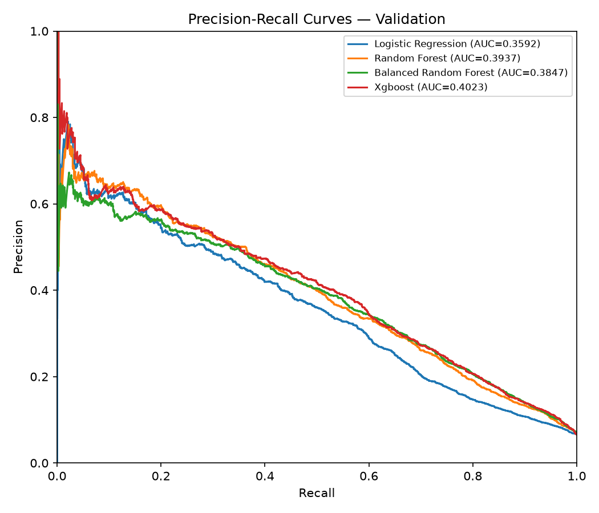
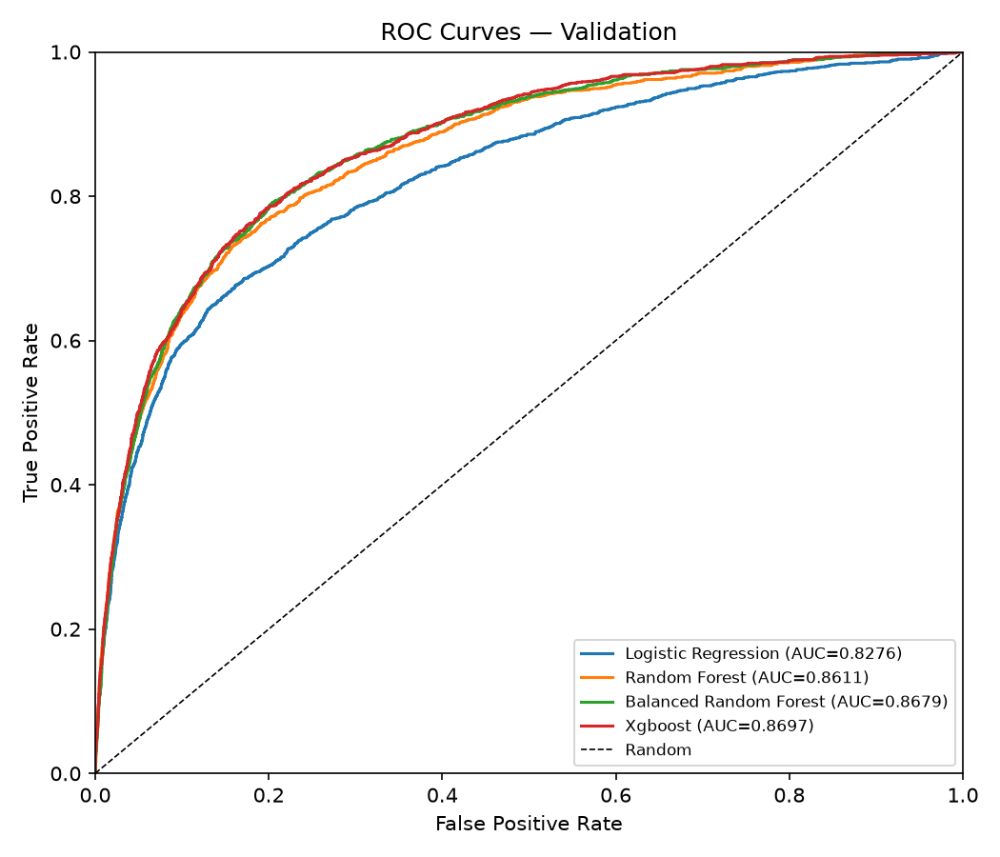
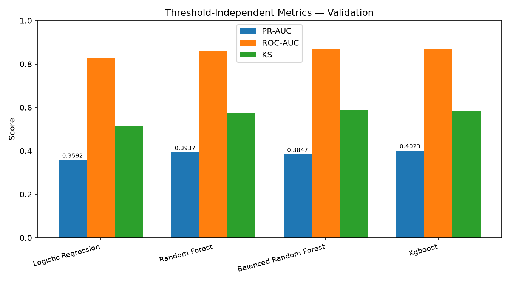
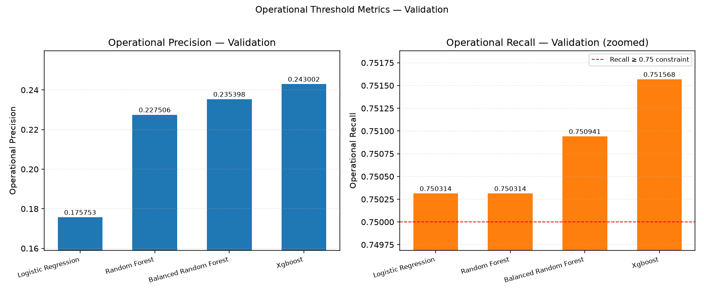
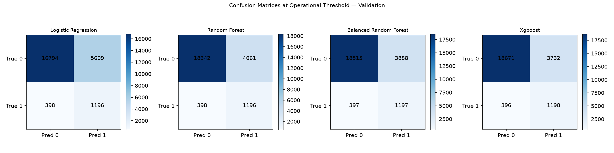

# Model Comparison Validation Report

> **Branch**: `feat/model-evaluation`
> **Base**: `integration/stage2`
> **Task**: Fair four-model Validation comparison and recommended-model selection
> **Evaluation split**: `validation` (Independent Test remains sealed)

## 1. Scope

This report documents the fair Validation comparison of the four core
credit-default models produced by the shared experiment runner on the frozen
64/16/20 split manifest:

- Logistic Regression
- Random Forest
- Balanced Random Forest
- XGBoost (pre-selected `xgb_child5` candidate)

All four models are rerun through `SharedExperimentRunner` on identical data,
preprocessing, feature, evaluation, and threshold contracts. No model accesses
the Independent Test set for metrics, predictions, threshold selection, or
model selection. The runner performs only transform / schema / finite checks on
Test features.

## 2. Frozen Data Contract

| Item | Value |
|---|---|
| Feature Set | B |
| Preprocessing | missing_plus_flag |
| Random seed | 42 |
| Evaluation split | validation |
| Manifest SHA-256 | `5c7aed175ae534f22b051e0b6375469aea71c16d3f28e07a97a60dffb4d520b5` |
| Raw data SHA-256 | `1bd46da486a5708c58c7b01a034fae2a13b327f6f7b62ea7ba4fe3b5824b24ac` |
| Training rows | 95,995 |
| Validation rows | 23,997 |
| Independent Test rows | 30,008 (sealed) |

## 3. Comparison Specifications

Each row is constructed as a controlled `ExperimentSpec`. Feature Set B +
`missing_plus_flag` + seed 42 is the frozen shared comparison contract
(`MODEL_ADAPTER_HANDOFF.md`). XGBoost uses the pre-selected `xgb_child5`
parameters from `XGBOOST_VALIDATION.md` Section 10.

| Model | class_weight | Key parameters |
|---|---|---|
| logistic_regression | balanced | config baseline (C=1.0, l2, liblinear, max_iter=5000) |
| random_forest | none | adapter defaults (n_estimators=300, max_depth=None, min_samples_leaf=2, max_features=sqrt) |
| balanced_random_forest | none | adapter defaults + internal balanced sampling |
| xgboost | none | max_depth=4, learning_rate=0.05, min_child_weight=5, subsample=0.8, colsample_bytree=0.8 |

## 4. Threshold-Independent Metrics (Validation)

| Model | PR-AUC | ROC-AUC | KS |
|---|---:|---:|---:|
| Logistic Regression | 0.359228 | 0.827584 | 0.514616 |
| Random Forest | 0.393716 | 0.861110 | 0.572985 |
| Balanced Random Forest | 0.384739 | 0.867921 | 0.587148 |
| **XGBoost (`xgb_child5`)** | **0.402297** | **0.869722** | 0.586536 |

Primary metric is Validation PR-AUC (`average_precision_score`). XGBoost has the
highest PR-AUC and ROC-AUC. Balanced Random Forest retains the highest KS
(0.587148 versus 0.586536).

## 5. Operational Threshold Metrics (Validation)

Operational rule: maximize Precision subject to Validation Recall >= 0.75.
Tie-break: higher Recall, then higher Threshold.

| Model | Op threshold | Precision | Recall | F1 |
|---|---:|---:|---:|---:|
| Logistic Regression | 0.422535 | 0.175753 | 0.750314 | 0.284796 |
| Random Forest | 0.086213 | 0.227506 | 0.750314 | 0.349146 |
| Balanced Random Forest | 0.468029 | 0.235398 | 0.750941 | 0.358437 |
| **XGBoost (`xgb_child5`)** | 0.553241 | **0.243002** | 0.751568 | 0.367259 |

Every model satisfies the Recall >= 0.75 constraint. XGBoost achieves the
highest operational Precision at the recall floor.

## 6. Confusion Matrices at Operational Threshold (Validation)

Positive class = 1 (SeriousDlqin2yrs = 1). Each matrix totals 23,997.

| Model | TN | FP | FN | TP | Total |
|---|---:|---:|---:|---:|---:|
| Logistic Regression | 16,794 | 5,609 | 398 | 1,196 | 23,997 |
| Random Forest | 18,342 | 4,061 | 398 | 1,196 | 23,997 |
| Balanced Random Forest | 18,515 | 3,888 | 397 | 1,197 | 23,997 |
| XGBoost (`xgb_child5`) | 18,671 | 3,732 | 396 | 1,198 | 23,997 |

## 7. Recommended Model

**Recommended: XGBoost (`xgb_child5`).**

Selection uses the pre-declared `model_selection.ordered_considerations` from
`configs/experiment.yaml`:

1. `pr_auc`
2. `roc_auc`
3. `operational_precision_with_recall_constraint`
4. `runtime`
5. `interpretability`

The selection is lexicographic with a 1e-6 tolerance on float metrics. XGBoost
is the unique highest-PR-AUC model (0.402297 versus Random Forest 0.393716, a
margin far exceeding 1e-6), so the first consideration alone determines the
recommendation. No later consideration was needed.

This recommendation is a **Validation** result only. It is not an Independent
Test or production performance claim, and it does not authorize a Test
evaluation. Any Test measurement requires the sealed-evaluation handoff process.

## 8. Reproducibility and Consistency

- `random_seed = 42` locked via `set_random_seeds()`.
- All rows are generated by `SharedExperimentRunner`; no values are copied from
  legacy reports.
- `scripts/run_model_comparison.py` performs a programmatic figure-vs-CSV
  consistency check that raises if any metric differs by more than 1e-6.
- All validation probability arrays are aligned to the same Validation row_id
  ordering before any metric is computed.

### Cross-platform note

The formal `XGBOOST_VALIDATION.md` reference run was executed on macOS/arm64
with Homebrew libomp. This comparison was rerun on a different platform.
Logistic Regression and Random Forest reproduce the reference PR-AUC to six
decimals; Balanced Random Forest differs by ~4e-6; XGBoost differs by ~3e-4.
The XGBoost difference is expected because `tree_method="hist"` with
`n_jobs=-1` is not bit-reproducible across platforms and thread counts. The
model ranking and the recommendation are unaffected: XGBoost remains the
highest-PR-AUC model by a wide margin.

## 9. Figures

Generated by `scripts/run_model_comparison.py` and copied to
`docs/assets/model_comparison/`:

## 10. Test Isolation

This task does NOT access Independent Test for prediction, metrics, confusion
matrices, threshold selection, model selection, or early stopping. The shared
runner performs only transform, schema-consistency, and finite-value checks on
Test features. See `SEALED_EVALUATION_HANDOFF.md` for the governance boundary
and the isolation of the legacy Forest Test artifacts.

## 11. Limitations

1. Single frozen Validation split; no cross-validation variance is reported.
2. Validation-only comparison; generalization on the sealed 20% Test holdout is
   not measured.
3. XGBoost internal `aucpr` early stopping differs from the shared
   `average_precision_score` used for ranking.
4. No fairness or calibration analysis.
5. Educational project; not for real credit decisions.
